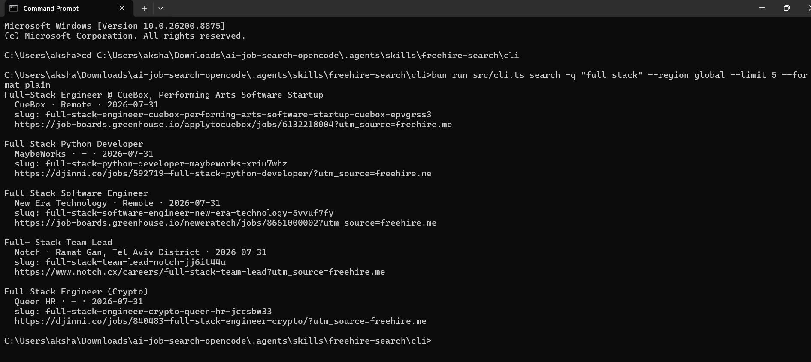
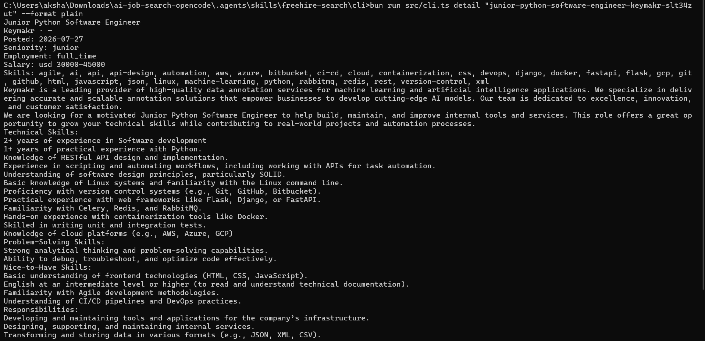

# Live Demo

This page captures **real, unmodified terminal output** from the tools in this
repo. Everything below was generated by running the actual code — no mockups.

## 1. Search jobs (freehire-search CLI)



```console
$ bun run src/cli.ts search -q "full stack" --region global --limit 3 --format plain

Full-Stack Engineer @ CueBox, Performing Arts Software Startup
  CueBox · Remote · 2026-07-31
  slug: full-stack-engineer-cuebox-performing-arts-software-startup-cuebox-epvgrss3
  https://job-boards.greenhouse.io/applytocuebox/jobs/6132218004?utm_source=freehire.me

Full Stack Python Developer
  MaybeWorks · — · 2026-07-31
  slug: full-stack-python-developer-maybeworks-xriu7whz
  https://djinni.co/jobs/592719-full-stack-python-developer/?utm_source=freehire.me

Full Stack Software Engineer
  New Era Technology · Remote · 2026-07-31
  slug: full-stack-software-engineer-new-era-technology-5vvuf7fy
  https://job-boards.greenhouse.io/neweratech/jobs/8661000002?utm_source=freehire.me
```

## 2. Get job details (freehire-search CLI)



```console
$ bun run src/cli.ts detail "junior-python-software-engineer-keymakr-slt34zut" --format plain

Junior Python Software Engineer
Keymakr · —
Posted: 2026-07-27
Seniority: junior
Employment: full_time
Salary: usd 30000–45000
Skills: agile, ai, api, api-design, automation, aws, azure, bitbucket, ci-cd, cloud, containerization, css, devops, django, docker, fastapi, flask, gcp, git, github, html, javascript, json, linux, machine-learning, python, rabbitmq, redis, rest, version-control, xml

Keymakr is a leading provider of high-quality data annotation services for machine learning and artificial intelligence applications. We specialize in delivering accurate and scalable annotation solutions that empower businesses to develop cutting-edge AI models. Our team is dedicated to excellence, innovation, and customer satisfaction.
```

## 3. The full workflow (opencode)

```console
$ opencode

/ setup          # onboards your profile (candidate profile, CV templates)
/ scrape         # searches configured job portals with your target queries
/ rank           # scores postings against your candidate profile
/ apply <url>    # tailors CV + cover letter to the posting, generates PDFs
/ outcome <url>  # records the result in job_search_tracker.csv
/html-report     # generates a self-contained HTML dashboard of your search
```

## What the tools do

| Step | Tool | What it does |
|------|------|--------------|
| Setup | `/setup` | Populates profile files: candidate profile, behavioral profile, CV/cover letter templates, search queries |
| Search | Portal CLIs (freehire, jobbank, jobindex, jobnet, linkedin) | Queries each portal's API, normalizes results to a common JSON shape |
| Evaluate | `/rank`, `tools/salary_lookup.py` | Scores postings against your profile; converts salaries across currencies/regions |
| Apply | `/apply` | Renders a tailored CV + cover letter via LaTeX (lualatex/xelatex), verifies the PDF text layer for ATS |
| Track | `/outcome`, `/html-report` | Records outcomes to the CSV tracker; renders a standalone HTML dashboard |
| Guard | `tools/security_guards.py` | CI check that blocks permission widening / weakened gitignore / lifecycle scripts |

---

*Demo captured on 2026-07-29 from the current `master`. To reproduce, follow
the [Quick start](../README.md#quick-start) instructions.*
